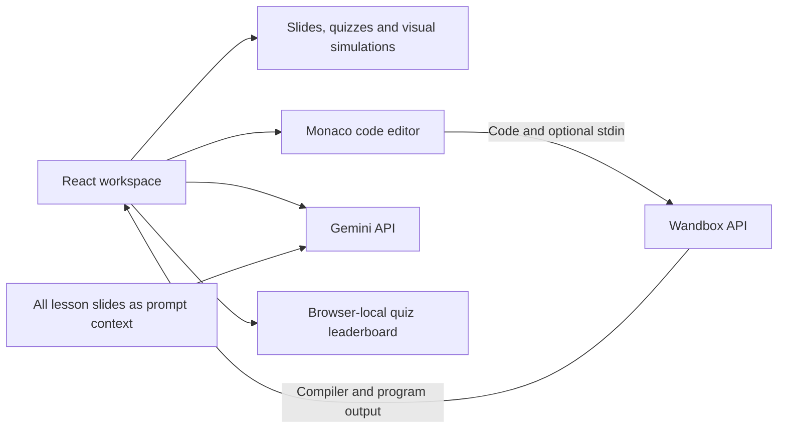

# C++ STL & Compiler Concepts Lab

An interactive learning workspace for C++ containers and compiler concepts, with visual simulations, executable examples, and a Gemini teaching assistant.

## Why this project exists

Container behavior and memory organization are easier to understand when explanations, code, and visual state can be explored together. This project connects those views in a browser-based learning flow.

The application is written in JavaScript/React. Its animations are teaching simulations; actual code compilation and execution are delegated to Wandbox.

## Architecture



There is no application backend. Gemini receives lesson text as a system instruction; the current implementation does not retrieve or rank documents.

## Engineering Highlights

- Data-driven visual steps connect highlighted C++ statements to illustrative container and memory state.
- Editable C++ examples separate compiler messages from program output; a floating IDE also offers C, Java, and Python through Wandbox.
- A Gemini assistant combines conversation history with the lesson material. Rendered Markdown is sanitized with DOMPurify.
- Timed quizzes provide feedback and store the top local results in `localStorage`.

## Tech Stack

| Area | Technologies |
| --- | --- |
| Application | React, JavaScript, Vite, Tailwind CSS, Framer Motion |
| Code and AI | Monaco Editor, Wandbox HTTP API, Google GenAI SDK |
| Content and rendering | Lesson datasets, Marked, DOMPurify, browser storage |

## How It Works

Choose a quiz, review the slides, edit a code example, then step through the animation lab. Code runs are sent to Wandbox. The optional assistant calls `gemini-2.5-flash` with chat history and the full slide context.

## Setup

Use **Node.js 22.12+**. The locked Vite dependency declares `^20.19.0 || >=22.12.0`.

```sh
git clone https://github.com/yashwant938/CompilerCppTopics.git
cd CompilerCppTopics
npm ci
npm run dev
```

Open the HTTPS URL printed by Vite, including `/CompilerCppTopics/`. The development configuration uses `vite-plugin-mkcert` for local certificates. Slides, quizzes, and simulations do not require a model key; compiler runs need Wandbox access.

For optional chat, enter your own Gemini key in the assistant settings. The key is held in browser state. The alternative `VITE_GEMINI_API_KEY` setting is bundled into frontend code and is not a server-side secret; do not put a shared production key there. A backend credential boundary is a future improvement.

Available project checks are `npm run lint` and `npm run build`; `npm run preview` serves the build locally. No automated application test suite is included.

## Example

Open the floating IDE, keep its default C++ program, and click **Run Code**. A successful Wandbox response displays `Hello C++!`. Then use the vector animation to step through `reserve`, `push_back`, insertion, and erasure. The animation state is illustrative, not a trace captured from that compiler execution.

## Engineering Challenges

- Coordinating lesson navigation, editor state, asynchronous API requests, and timed quiz feedback.
- Explaining memory concepts without presenting simplified diagrams as actual addresses or standard-library implementation guarantees.
- Keeping generated explanations separate from compiler output and handling external-service failures visibly.

## Future Improvements

- Move shared model credentials behind an authenticated backend with request limits.
- Add tests for quiz scoring, navigation, animation data, and provider failure states.
- Validate teaching examples against pinned compiler versions and document implementation-dependent behavior.
- Add source citations and selective lesson retrieval if the content grows beyond a single prompt context.
